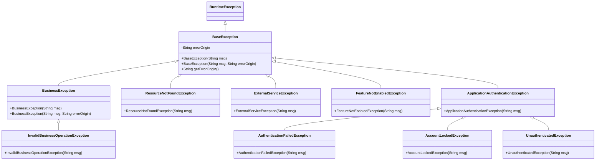

## 当前异常类依赖图

以下依赖关系基于 `sky-common/src/main/java/com/sky/exception` 包内当前源码整理。

### 依赖关系说明

- `BaseException` 是项目自定义异常根类，继承 `RuntimeException`，并额外持有 `errorOrigin`，用于标记错误来源。
- `BusinessException` 继承 `BaseException`，表示通用业务规则失败；`InvalidBusinessOperationException` 进一步继承 `BusinessException`，表示资源状态或业务约束导致当前操作不允许执行。
- `ApplicationAuthenticationException` 继承 `BaseException`，是认证鉴权相关异常的父类；`AuthenticationFailedException`、`AccountLockedException`、`UnauthenticatedException` 都依赖它完成认证类异常分组。
- `ResourceNotFoundException`、`ExternalServiceException`、`FeatureNotEnabledException` 直接继承 `BaseException`，分别表达资源不存在、外部服务失败、功能未启用等独立异常类别。
- `BaseException` 的 `errorOrigin` 当前只由 `BusinessException(String msg, String errorOrigin)` 暴露传入入口，其他子类目前仅透传 `msg`。

### 服务端使用关系概览

```mermaid
classDiagram
    GlobalExceptionHandler ..> FeatureNotEnabledException : handles
    GlobalExceptionHandler ..> BusinessException : handles
    GlobalExceptionHandler ..> InvalidBusinessOperationException : handles
    GlobalExceptionHandler ..> ApplicationAuthenticationException : handles
    GlobalExceptionHandler ..> BaseException : fallback handles

    JwtTokenAdminInterceptor ..> UnauthenticatedException : throws
    JwtTokenUserInterceptor ..> UnauthenticatedException : throws
    EmployeeServiceImpl ..> AuthenticationFailedException : throws
    EmployeeServiceImpl ..> AccountLockedException : throws
    OrderServiceImpl ..> BusinessException : throws
    OrderController ..> ResourceNotFoundException : throws
    CategoryServiceImpl ..> InvalidBusinessOperationException : throws
    DishServiceImpl ..> InvalidBusinessOperationException : throws
    SetmealServiceImpl ..> InvalidBusinessOperationException : throws
    UserController ..> FeatureNotEnabledException : throws
```

## 异常类说明

### BusinessException

BusinessException 表示请求违反了业务规则，但系统本身仍然正常运行。
handler 返回 warn 级别日志

它是业务异常的通用父类，适用于不属于更具体异常类别的业务失败，例如：

购物车为空，不能下单
收货地址为空，不能下单
订单已支付，不能重复支付

#### InvalidBusinessOperationException

InvalidBusinessOperationException 继承自 BusinessException，表示请求执行的操作本身是合法的，但由于资源当前状态、关联关系或业务约束，该操作暂时不允许执行。
handler 返回 info 级别日志

典型场景包括：

分类已关联菜品或套餐，不能删除
菜品正在售卖，不能删除
套餐正在售卖，不能删除
菜品已被套餐关联，不能删除
套餐包含未启售菜品，不能启售